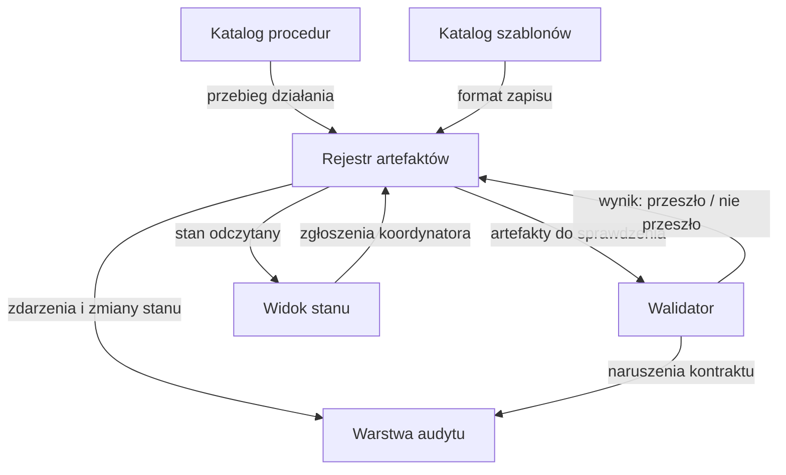

# Architektura BMS

Opis architektury **pojęciowej** symulacyjnego środowiska BMS. Nie jest opisem wdrożenia: na tym etapie projekt nie ma integracji produkcyjnych — patrz [integracje](integracje.md) i [ADR-001](decyzje/adr-001-zakres-symulacyjny.md).

## Zasada wiodąca

**Pliki dokumentacji są źródłem prawdy. Widok jest widokiem i kanałem zwrotnym, nigdy drugą prawdą — przy rozjeździe rozstrzyga plik.**

Z tej zasady wynika reguła, którą musi respektować każdy element architektury: zgłoszenie przyjęte przez widok **nie zmienia stanu scenariusza samo z siebie**. Autor prowadzący je odczytuje, przepisuje do planu operacji i dopiero ten zapis jest stanem. Architektura, która pozwala widokowi zapisać stan bezpośrednio, łamie [ADR-002](decyzje/adr-002-markdown-zrodlo-prawdy.md).

## Pięć elementów

### Katalog procedur

**Rola:** przechowuje opisy przebiegu działania.

**Przyjmuje:** propozycje zmian przechodzące przez [politykę zmian procedur](../06-governance/polityka-zmian-procedur.md).

**Wydaje:** procedurę o dziewięciu wymaganych sekcjach, gotową do wykonania bez dopytywania.

**Styka się z:** katalogiem szablonów (każda procedura wskazuje szablon albo jawnie stwierdza „nie dotyczy"), rejestrem artefaktów (procedura mówi, jakie artefakty powstają i w jakim stanie), walidatorem (kompletność sekcji jest sprawdzana maszynowo).

Realizacja: [`docs/03-procedures/`](../03-procedures/README.md).

### Katalog szablonów

**Rola:** przechowuje formaty zapisu artefaktów.

**Przyjmuje:** zmiany formatu wraz z oceną wpływu na kontrakt danych i przykłady.

**Wydaje:** pusty szablon z instrukcją wypełniania każdego pola oraz odnośnikiem do kontraktu danych.

**Styka się z:** kontraktami w [`schemas/`](../../schemas/) — szablon i kontrakt opisują ten sam artefakt z dwóch stron: szablon dla człowieka, kontrakt dla maszyny. Rozjazd między nimi jest defektem.

Realizacja: [`docs/04-templates/`](../04-templates/README.md).

### Rejestr artefaktów

**Rola:** przechowuje artefakty scenariusza wraz z ich identyfikatorami, statusami, autorami i powiązaniami.

**Przyjmuje:** artefakty wytworzone wg szablonów; zgłoszenia z widoku stanu jako **propozycje**, nie jako zmiany stanu.

**Wydaje:** stan artefaktu, jego historię zmian i graf powiązań między artefaktami.

**Styka się z:** wszystkimi pozostałymi elementami. Jest jedynym miejscem, w którym stan artefaktu jest prawdą.

Realizacja na tym etapie: plan operacji i dziennik operacyjny jako pliki w repozytorium. Rejestr jako odrębny mechanizm nie istnieje i jest przedmiotem dalszych prac — patrz [status projektu](../00-overview/status-projektu.md).

### Walidator

**Rola:** sprawdza maszynowo to, co da się sprawdzić maszynowo, i kończy pracę kodem niezerowym przy naruszeniu.

**Przyjmuje:** pliki kontraktów danych oraz pliki procedur.

**Wydaje:** wynik binarny wraz z listą naruszeń: dla kontraktów — poprawność JSON, obecność `$schema`, `title`, `type`, `properties`, `required` i typ główny `object`; dla procedur — obecność wszystkich dziewięciu sekcji.

**Styka się z:** automatyczną walidacją w [`.github/workflows/validate-docs.yml`](../../.github/workflows/validate-docs.yml), uruchamianą dla każdego pull requesta i przy zmianie gałęzi domyślnej.

**Granica, którą trzeba znać:** walidator jest **jedyną blokadą techniczną** w tym repozytorium. Reguły zapisane w procedurach, szablonach i dokumentach governance są kontekstem, nie mechanizmem, i wykonawca może je pominąć. Reguła, która ma naprawdę obowiązywać, musi trafić do walidatora albo do kontraktu danych.

Realizacja: [`scripts/validate_schemas.py`](../../scripts/validate_schemas.py), [`scripts/validate_markdown.sh`](../../scripts/validate_markdown.sh).

### Warstwa audytu

**Rola:** zapisuje, co się wydarzyło, w kolejności, w jakiej się wydarzyło, oraz każde naruszenie reguły.

**Przyjmuje:** zdarzenia z rejestru artefaktów i naruszenia od walidatora.

**Wydaje:** rejestr zdarzeń i rejestr naruszeń, oba wyłącznie dopisywane.

**Styka się z:** dziennikiem operacyjnym jako swoją realizacją oraz z [procedurą meldunku](../03-procedures/meldunek.md), która konfrontuje plan z zapisem audytu przy zamknięciu scenariusza.

**Zasada:** wpis raz zapisany nie jest poprawiany — błąd prostuje wpis następny. Poprawianie wpisów niszczy jedyną wartość audytu, czyli możliwość wykrycia rozjazdu między dwoma zapisami.

Realizacja: [`docs/04-templates/dziennik-operacyjny.md`](../04-templates/dziennik-operacyjny.md).

## Przepływ informacji w scenariuszu

| Etap | Element wiodący | Co powstaje |
| --- | --- | --- |
| [think-tank](../03-procedures/think-tank.md) | katalog procedur i szablonów | plan operacji `zatwierdzony`, dziennik `szkic`, widok `opublikowany` |
| [rozpoznanie](../03-procedures/rozpoznanie.md) | rejestr artefaktów | wypełnione położenie w planie operacji |
| [przejazd](../03-procedures/przejazd.md) | rejestr artefaktów i walidator | stany pozycji mapy, wpisy audytu, SITREP |
| [zwiad](../03-procedures/zwiad.md) | warstwa audytu | zwrot wg kontraktu, wpis do dziennika |
| [meldunek](../03-procedures/meldunek.md) | warstwa audytu | raport końcowy z tabelą wniosków |

## Etap dojrzałości elementów

Ocena stanu, nie planu. Element „opisany" ma dokument; element „zrealizowany" ma działający mechanizm.

| Element | Opisany | Zrealizowany | Uwagi |
| --- | --- | --- | --- |
| Katalog procedur | tak | tak | siedem procedur, kompletność sprawdzana maszynowo |
| Katalog szablonów | tak | tak | cztery szablony, każdy z odnośnikiem do kontraktu |
| Rejestr artefaktów | tak | częściowo | realizowany plikami; brak odrębnego mechanizmu i historii zmian |
| Walidator | tak | tak | dwa skrypty plus automatyczna walidacja |
| Warstwa audytu | tak | częściowo | realizowana szablonem dziennika; brak automatycznego zapisu zdarzeń |

## Powiązane artefakty

- Decyzje: [ADR-001](decyzje/adr-001-zakres-symulacyjny.md), [ADR-002](decyzje/adr-002-markdown-zrodlo-prawdy.md), [ADR-003](decyzje/adr-003-json-schema.md), [ADR-004](decyzje/adr-004-rozdzielenie-artefaktow.md)
- Architektura: [model danych](model-danych.md), [model stanów](model-stanow.md), [integracje](integracje.md)
- Szablon: [BMS](../04-templates/wpis-bms.md)
- Referencja: [prompt projektowy interfejsu BMS](../05-reference/prompt-bms-design.md)
