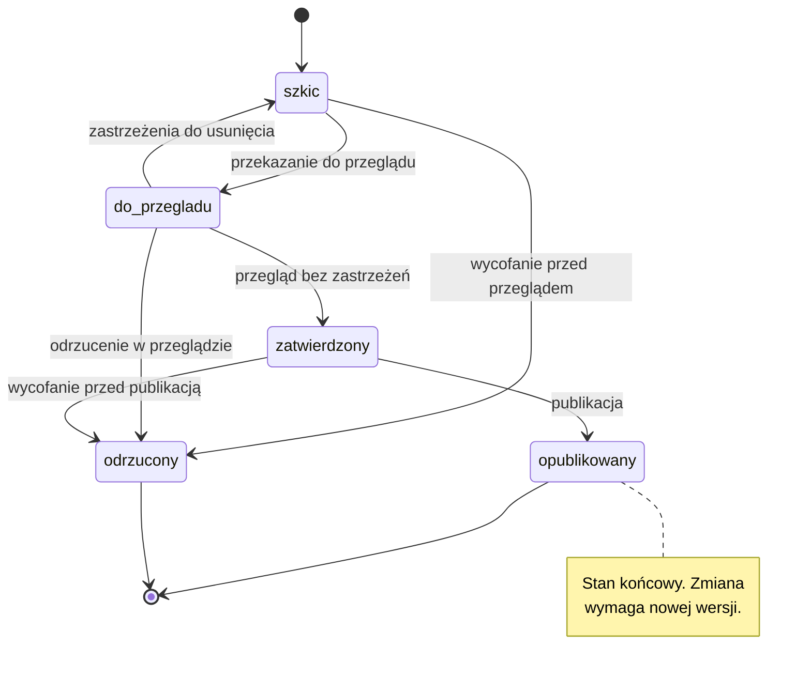

# Model stanów

## Dwa różne słowniki — rozstrzygnięcie

W materiałach tego projektu występują **dwa odrębne słowniki stanów**. Mieszanie ich wystąpiło w dokumentach źródłowych i jest najczęstszym błędem przy pracy nad tą dokumentacją.

| Pojęcie | Słownik | Czego dotyczy | Gdzie obowiązuje |
| --- | --- | --- | --- |
| **Cykl życia artefaktu** | `szkic` → `do-przegladu` → `zatwierdzony` → `opublikowany`, plus `odrzucony` | dokument jako całość: plan operacji, wpis BMS, komunikat, SITREP | kontrakty w [`schemas/`](../../schemas/), [szablony](../04-templates/README.md), cała ta dokumentacja |
| **Stan pozycji mapy** | `niezaliczone` → `w toku` → `zielone` → `odrzucone` | jeden wiersz mapy etapów wewnątrz planu operacji | materiał źródłowy; w tej dokumentacji opisany, ale **nieobjęty kontraktami danych** |

**Rozstrzygnięcie:** oba słowniki pozostają, jako dwa różne pojęcia. Kontrakty JSON Schema opisują **wyłącznie cykl życia artefaktu**. Stan pozycji mapy jest polem wewnątrz planu operacji i nie ma własnego kontraktu.

Trzecią, jeszcze inną rzeczą jest **postęp** — podawany jako „zaliczone wobec wszystkich". Postęp nie jest stanem, jest liczbą wyliczoną ze stanów pozycji. Stan pozycji, status całego scenariusza i postęp są trzema różnymi rzeczami.

Zapis rozbieżności i dokument rozstrzygający: [pochodzenie materiałów](../05-reference/sources.md), wiersz 2.

## Cykl życia artefaktu

## Przejścia dozwolone

| Ze stanu | Do stanu | Warunek | Kto wykonuje |
| --- | --- | --- | --- |
| — | `szkic` | utworzenie artefaktu wg szablonu | autor |
| `szkic` | `do-przegladu` | wypełnione wszystkie pola obowiązkowe szablonu | autor |
| `do-przegladu` | `zatwierdzony` | przegląd bez zastrzeżeń, kryteria akceptacji spełnione | recenzent |
| `do-przegladu` | `szkic` | zastrzeżenia wymagające poprawki | recenzent |
| `zatwierdzony` | `opublikowany` | walidacja przechodzi, powiązane artefakty spójne | koordynator |
| `szkic` | `odrzucony` | wycofanie przed przeglądem | autor albo koordynator |
| `do-przegladu` | `odrzucony` | odrzucenie w przeglądzie, z podanym powodem | recenzent albo koordynator |
| `zatwierdzony` | `odrzucony` | wycofanie przed publikacją, z podanym powodem | koordynator |

## Przejścia niedozwolone

| Ze stanu | Do stanu | Dlaczego |
| --- | --- | --- |
| `szkic` | `zatwierdzony` | zatwierdzenie bez przeglądu obchodzi jedyny punkt kontroli treści |
| `szkic` | `opublikowany` | pomija zarówno przegląd, jak i zatwierdzenie |
| `do-przegladu` | `opublikowany` | pomija zatwierdzenie |
| `opublikowany` | dowolny inny | stan końcowy; zmiana wymaga **nowej wersji** artefaktu, nie zmiany stanu istniejącego |
| `odrzucony` | dowolny inny | stan końcowy; powrót do pracy oznacza **nowy artefakt** z odnośnikiem do odrzuconego |

Przejście niedozwolone nie jest błędem walidatora — kontrakty danych sprawdzają wartość pola `status`, nie legalność przejścia. Kontrola przejść jest dziś **zapisem, nie mechanizmem**; jej egzekwowanie wymagałoby rozszerzenia walidatora.

## Ścieżka odrzucenia

Odrzucenie jest dostępne z każdego stanu przed publikacją i wymaga trzech rzeczy:

1. **Powodu** — jednym zdaniem, wskazującego, co konkretnie nie zostało spełnione.
2. **Wskazania kryterium** — którego z [kryteriów akceptacji](../01-product/kryteria-akceptacji.md) artefakt nie spełnia.
3. **Wpisu w warstwie audytu** — wiersz w dzienniku operacyjnym, z identyfikatorem artefaktu.

Odrzucenie jest **rozstrzygnięciem, nie stratą**. Artefakt odrzucony pozostaje w repozytorium jako zapis; jego usunięcie zabiera informację o tym, że decyzja była podejmowana.

## Kto zmienia stan

Uprawnienia do zmiany stanu wynikają z [macierzy uprawnień](../01-product/role-i-uprawnienia.md). Zasada nadrzędna: **o przejściu do stanu końcowego nie orzeka ten, kto artefakt wytworzył.** Autor nie zatwierdza własnego artefaktu i nie publikuje go.

Wyjątek dotyczy wyłącznie przejścia `szkic` → `odrzucony`: autor może wycofać własny szkic, bo nie przeszedł on jeszcze przez żaden przegląd.

## Zapis historii zmian

Każda zmiana stanu wchodzi wierszem do [dziennika operacyjnego](../04-templates/dziennik-operacyjny.md): czas, identyfikator artefaktu, zdarzenie, nowy status, autor zmiany, uwagi.

Historia jest wyłącznie dopisywana. Wpis raz zapisany nie jest poprawiany — błąd prostuje wpis następny. Rozjazd między statusem w artefakcie a ostatnim wpisem w dzienniku jest **faktem do wypisania** przy przeglądzie poobserwacyjnym, nie rozbieżnością do wygładzenia.

Wersjonowanie samego artefaktu przy zmianie po publikacji: [polityka wersjonowania](../06-governance/polityka-wersjonowania.md).

## Powiązane artefakty

- Kontrakty danych: [`schemas/`](../../schemas/) — wszystkie cztery używają tego samego słownika statusów
- Szablony: [plan operacji](../04-templates/plan-operacji.md), [BMS](../04-templates/bms.md), [SITREP](../04-templates/sitrep.md), [dziennik operacyjny](../04-templates/dziennik-operacyjny.md)
- Architektura: [architektura BMS](architektura-bms.md), [model danych](model-danych.md)
- Produkt: [role i uprawnienia](../01-product/role-i-uprawnienia.md), [kryteria akceptacji](../01-product/kryteria-akceptacji.md)
- Pochodzenie rozbieżności: [pochodzenie materiałów](../05-reference/sources.md)
