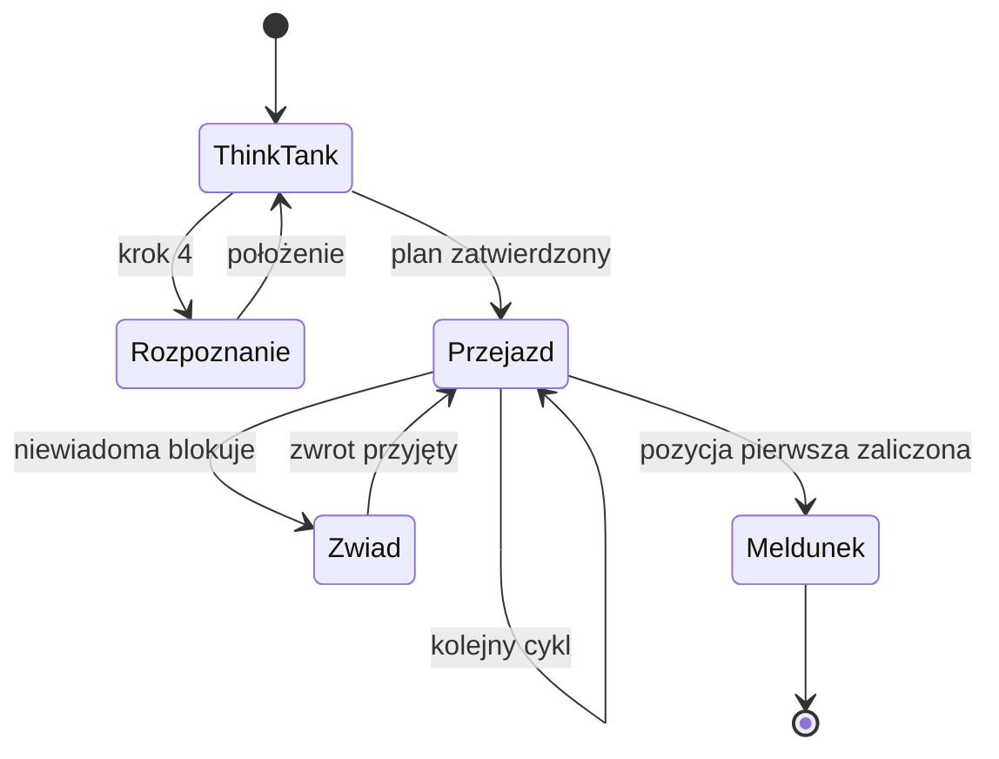

# Procedury

Procedura opisuje **przebieg działania**: kto, w jakiej kolejności, na podstawie czego i z jakim rozstrzygnięciem. Nie opisuje formatu zapisu — ten należy do [szablonu](../04-templates/README.md) — ani nie zawiera wypełnionych danych, które należą do [przykładu](../../examples/).

Wszystkie procedury dotyczą wyłącznie fikcyjnych scenariuszy szkoleniowych.

## Wymagana struktura

Każdy plik w tym katalogu poza `README.md` musi zawierać dokładnie dziewięć sekcji: Cel, Zakres, Role, Dane wejściowe, Kroki, Punkty decyzyjne, Dane wyjściowe, Wyjątki, Powiązane artefakty. Kompletność sprawdza [`scripts/validate_markdown.sh`](../../scripts/validate_markdown.sh) i brak choćby jednej sekcji kończy walidację kodem niezerowym.

## Zawartość katalogu

Katalog zawiera wyłącznie osiem plików: `README.md`, `komenda.md`, `lacznosc.md`, `meldunek.md`, `przejazd.md`, `rozpoznanie.md`, `zwiad.md` i `think-tank.md`. Odtworzenie listy: `find docs/03-procedures -maxdepth 1 -type f -name '*.md' -printf '%f\n' | sort`. Każdy inny dokument - notatka, przykład, szablon, opis decyzji - należy do odpowiedniego innego katalogu dokumentacji: [szablony](../04-templates/README.md), [przykłady](../../examples/), [architektura i decyzje](../02-architecture/) albo [materiały referencyjne](../05-reference/README.md).

Dwie rzeczy trzeba tu odróżnić:

- **Blokada techniczna.** [`scripts/validate_markdown.sh`](../../scripts/validate_markdown.sh) obejmuje każdy plik Markdown znaleziony w tym katalogu poza `README.md` i wymaga od niego dokładnie dziewięciu sekcji. Plik o innej strukturze dodany do tego katalogu kończy walidację kodem niezerowym - to mechanizm, nie zapis.
- **Zasada organizacyjna.** Zamknięta lista plików powyżej jest zapisem w tym README. Sama nie blokuje CI: walidator nie porównuje zawartości katalogu z listą, więc dokument o dziewięciu prawidłowych sekcjach, lecz niebędący procedurą, przejdzie kontrolę maszynową. Wyłapuje go przegląd zmiany, nie skrypt.

## Mapa procedur

| Procedura | Główny rezultat | Powiązany szablon |
| --- | --- | --- |
| [think-tank](think-tank.md) | zatwierdzony plan scenariusza wraz z mapą etapów | [plan operacji](../04-templates/plan-operacji.md) |
| [rozpoznanie](rozpoznanie.md) | wypełnione położenie: co · czym sprawdzone · wynik | [plan operacji](../04-templates/plan-operacji.md) |
| [zwiad](zwiad.md) | zwrot z jednym faktem, poniżej 2 000 znaków | [dziennik operacyjny](../04-templates/dziennik-operacyjny.md) |
| [przejazd](przejazd.md) | zamknięty cykl etapu z rozstrzygniętym stanem pozycji | [SITREP](../04-templates/sitrep.md) |
| [komenda](komenda.md) | rozpoznane i zapisane polecenie koordynatora | [dziennik operacyjny](../04-templates/dziennik-operacyjny.md) |
| [łączność](lacznosc.md) | pytanie zadane kanałem, którego odpowiedź da się wykorzystać | nie dotyczy — procedura nie wytwarza własnego artefaktu, a jej rezultat zapisuje się w dzienniku albo w planie |
| [meldunek](meldunek.md) | raport końcowy z tabelą wniosków | [plan operacji](../04-templates/plan-operacji.md), sekcja raportu |

## Kolejność czytania

1. [think-tank](think-tank.md) — wejście w scenariusz, wraz z [rozpoznaniem](rozpoznanie.md), które jest jednym z jego kroków.
2. [przejazd](przejazd.md) — powtarzalny cykl pracy; czytaj razem z [zwiadem](zwiad.md), wywoływanym z jego wnętrza.
3. [meldunek](meldunek.md) — zamknięcie scenariusza.
4. [komenda](komenda.md) i [łączność](lacznosc.md) — procedury przekrojowe, obowiązujące w każdym etapie; czytaj przy pierwszym poleceniu koordynatora i przy pierwszym pytaniu do niego.

## Zależności między procedurami

Procedury [komenda](komenda.md) i [łączność](lacznosc.md) nie mają miejsca w tym przepływie, bo obowiązują we wszystkich jego stanach.
